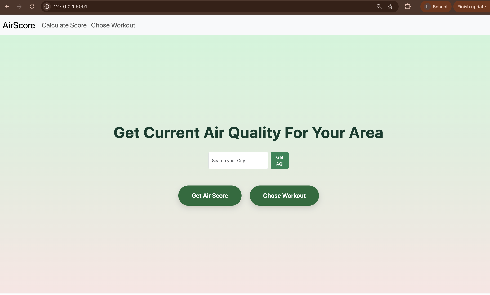
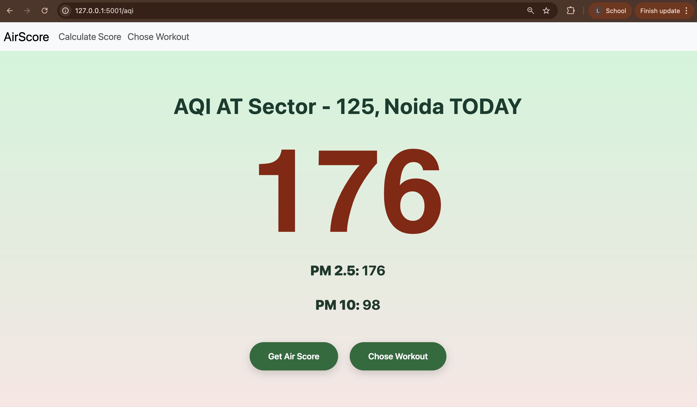
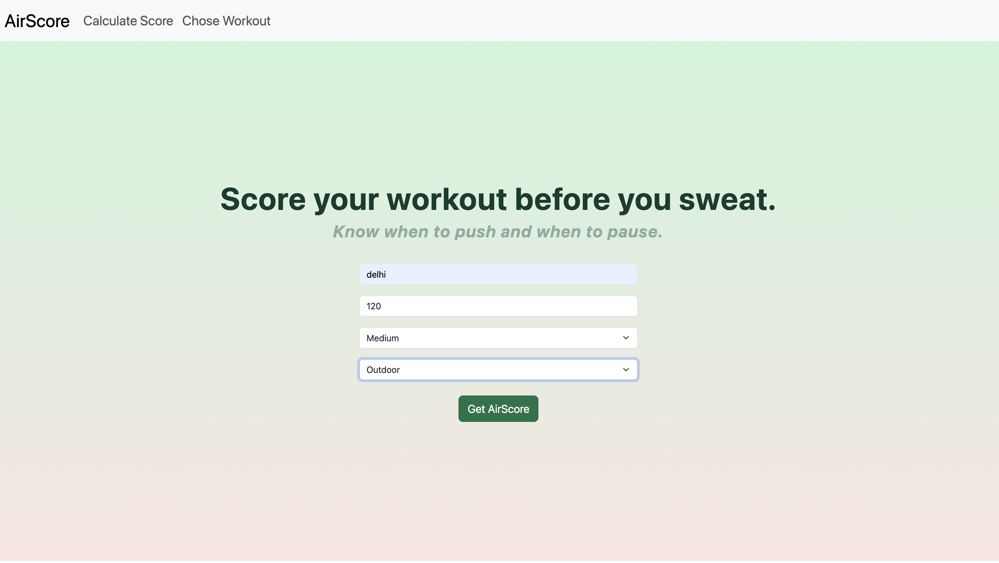
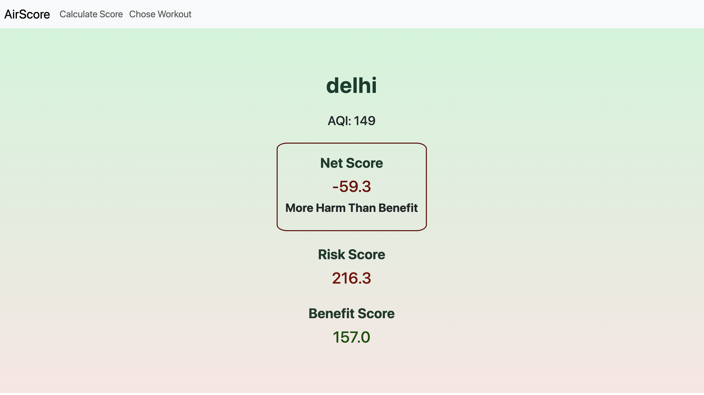
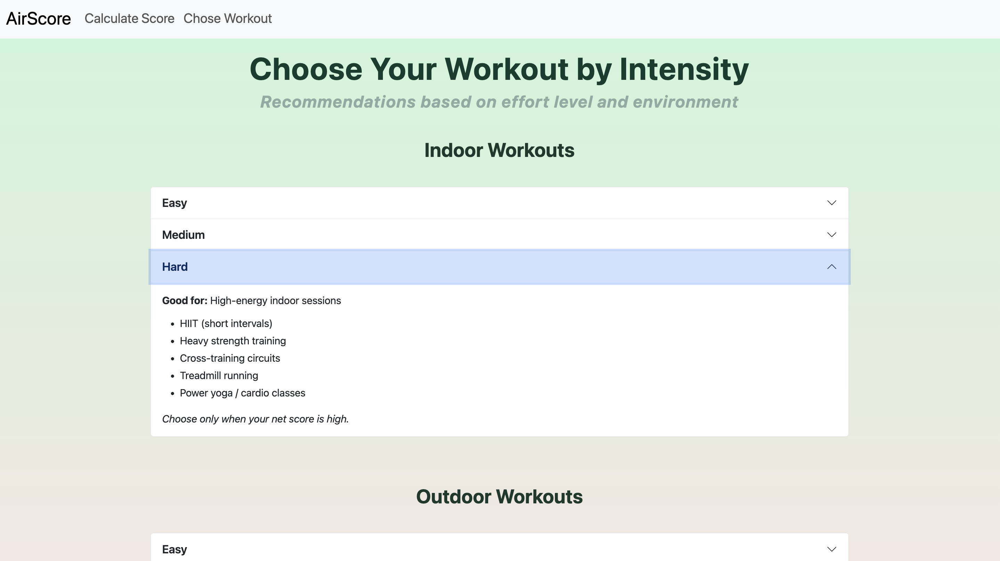

# Save Your Breath, Score Your Workout

A web app that scores your workout by combining exercise benefits with air quality risk, helping you decide whether your planned workout is worth it. It also provides indoor and outdoor workout recommendations and shows the current AQI for your location.

---

##Results






---

## Features

-Scores your planned workout using exercise benefits vs air quality risk
-Recommends indoor or outdoor workouts based on current AQI
-Shows real-time AQI for any city around the World

---

## AQICN API Key

**Note:** The AQICN API key included in this project is for **academic demonstration only**.  

If you want to run your own version, register for a free API key [here](https://aqicn.org/data-platform/token/#/).

---

## Installation / Usage

1. Clone this repository:
```bash
git clone https://github.com/lavanyanigam/AirScore.git
cd AirScore

